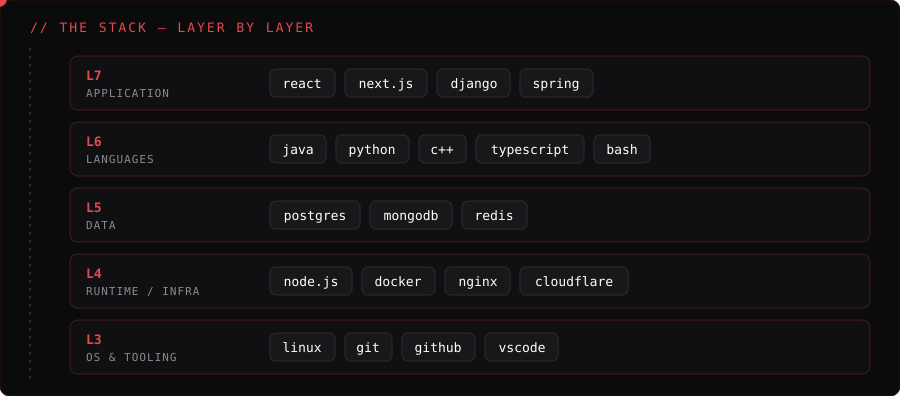

 

  

 

**I build software to understand how systems behave.**

## `> featured`

<table>
<tr>
<td width="50%"></td>
<td width="50%"></td>
</tr>
<tr>
<td width="50%"></td>
<td width="50%"></td>
</tr>
</table>

## `> telemetry`

## `> live feed`

<picture>
<source media="(prefers-color-scheme: dark)" srcset="https://raw.githubusercontent.com/astrolabscig/astrolabscig/output/github-snake-dark.svg">
<source media="(prefers-color-scheme: light)" srcset="https://raw.githubusercontent.com/astrolabscig/astrolabscig/output/github-snake.svg">

</picture>

**Recent activity**

<!--START_SECTION:activity-->
1. 💪 Opened PR [#2](https://github.com/kweku461/Food-Delivery-And-Logistics-/pull/2) in [kweku461/Food-Delivery-And-Logistics-](https://github.com/kweku461/Food-Delivery-And-Logistics-)
2. 💪 Opened PR [#4](https://github.com/kweku461/api-fundamentals/pull/4) in [kweku461/api-fundamentals](https://github.com/kweku461/api-fundamentals)
3. 🎉 Merged PR [#1](https://github.com/kweku461/api-fundamentals/pull/1) in [kweku461/api-fundamentals](https://github.com/kweku461/api-fundamentals)
4. 💪 Opened PR [#1](https://github.com/kweku461/api-fundamentals/pull/1) in [kweku461/api-fundamentals](https://github.com/kweku461/api-fundamentals)
<!--END_SECTION:activity-->

<b>OPEN THE LAB</b>

 

* building useful software
* understanding systems beneath frameworks
* developer tooling & infrastructure
* artificial intelligence
* networking & security fundamentals
* open-source contribution
* experiments that answer interesting questions

 

`LEARN → BUILD → BREAK → INVESTIGATE → REBUILD`

**BUILD · INVESTIGATE · REPEAT**

